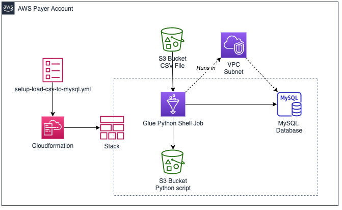

# Load S3 CSV to MySQL

This package creates a Glue Python Shell Job that will load data from a CSV file in S3 to a MySQL database server for ELT workflows. The script itself can also be run standalone outside of Glue.

An example CloudFormation template is provided to setup the Glue Python Shell Job and its dependencies.

This script uses the [AWS Data Wrangler](https://github.com/awslabs/aws-data-wrangler) package.



## Functionality
- The script uses a Glue Python Shell Job to load data from a CSV file into a Pandas DataFrame and then write it to a table in a MySQL Database.
- It's possible to specify that the table be dropped and recreated with each execution by specifying `--drop_table True`. Alternatively, if you wish to delete all rows but leave the table (and its schema) intact, you can specify `--delete_rows True`. 
- The database credentials can either be specified in the parameters (**NOT RECOMMENDED EVER OUTSIDE OF LOCAL TEST**) or retrieved from an AWS Secrets Manager Secret

This script is intended to be as generic/boilerplate as possible. It does not hardcode table schemas or data types, nor does it depend on AWS Glue data catalog or predefined databases or schemas within the catalog. Therefore, you may need or want to customize this script to better suit your use case. 

## Prerequisites
1. To use as a Glue Python Shell Job, you must have a VPC with connectivity to the target MySQL database. If connecting over internet, you must use a private subnet that routes internet-bound traffic through a NAT Gateway or NAT instance. This is because Glue Jobs that run in a VPC are not assigned public IP addresses. Alternatively, you could modify the template and remove the Glue Connection form the job so that it runs outside a VPC.

## How it works

The CloudFormation template used in the setup below creates the following resources:

* **Glue Python Shell Jobs**- These shell job contains a Python script that will perform the ELT operations, loading the data from the CSV into a Pandas DataFrame and then writing it to the database table. . 

The Python script used by Glue leverages the [AWS Data Wrangler](https://aws-data-wrangler.readthedocs.io/en/latest/what.html) library. This package extends the popular Pandas library to AWS services, making it easy to connect to, load, and save [Pandas](https://github.com/pandas-dev/pandas) dataframes with many AWS services, including S3, Glue, Redshift, EMR, Athena, and Cloudwatch Log Insights. In a few lines of code, the script performs the following steps:

1. Establishes a connection to the database server
2. (Optionally) Drops the table or deletes all rows in the table
3. Loops through the CSV file in S3, loading `chunk_size` rows at a time into a Pandas DataFrame and then writing them to the database table. This is done to limit the amount of memory consumed by the DataFrame. The `chunk_size` is a parameter that can be adjusted.

### Technical Note: 
If the table does not exist, the columns and column types will be inferred from the CSV. The underlying method for donig this is to call `pandas.DataFrame.convert_dtypes()`. You may need to predefine the table/schema if you need more control.

## Setup

1. Deploy the CloudFormation template, setup-load-csv-to-mysql.yml. Specify the source bucket name and path where the CSV file is located.

2. After the CloudFormation stack is created, go to outputs and click the link to the S3 bucket that the stack created.

3. Upload: `awswrangler-2.5.0-py3-none-any.whl` and `load_csv_to_mysql.py`

4. Go to the [AWS Glue console](https://console.aws.amazon.com/glue/home?region=us-east-1#etl:tab=jobs) and run the `[stackname]-[databasename]-csv-load` job. Verify it completes successfully and review the logs.

    ```
## Additional Features
The Glue jobs are configured to pass arguments to the script that determine how it will write the CSV. Additionally, the script can be used outside of a Glue job as a command line utility. Below are the options that the script accepts as input:

```
usage: load_csv_to_mysql.py [-h] --s3_object S3_OBJECT [--db_host DB_HOST] [--db_port DB_PORT] [--db_name DB_NAME] [--db_user DB_USER] [--db_password DB_PASSWORD] [--db_secret_arn DB_SECRET_ARN]
                            --table_name TABLE_NAME [--drop_table DROP_TABLE] [--delete_rows DELETE_ROWS] [--delete_mode DELETE_MODE] [--chunk_size CHUNK_SIZE] [--extra-py-files EXTRA_PY_FILES]
                            [--scriptLocation SCRIPTLOCATION] [--job-bookmark-option JOB_BOOKMARK_OPTION] [--job-language JOB_LANGUAGE] [--connection-names CONNECTION_NAMES]

Reads a CSV file from S3 and loads records into a table

optional arguments:
  -h, --help            show this help message and exit
  --s3_object S3_OBJECT
                        The S3 path where the CSV object is located. Must be formatted 's3://bucket-name/prefix/object.csv'
  --db_host DB_HOST     The hostname of the database server to connect to. If not set, will be retrieved from secrets manager secret.
  --db_port DB_PORT     The port of the database server to connect to. If not set, will be retrieved from secrets manager secret or default port will be used.
  --db_name DB_NAME     The name of the database where the data will be inserted. If not set, will be retrieved from secrets manager secret.
  --db_user DB_USER     The database user to connect as. It is HIGHLY recommended you store your credentials in secrets manager and use db_secret_arn instead!
  --db_password DB_PASSWORD
                        The database user password. It is HIGHLY recommended you store your credentials in secrets manager and use db_secret_arn instead!
  --db_secret_arn DB_SECRET_ARN
                        ARN of AWS Secrets Manager secret containing the credentials for conneting to the database server
  --table_name TABLE_NAME
                        The name of the table that records will be inserted into. NOTE: The table will be created if it does not exist.
  --drop_table DROP_TABLE
                        When set, the database table will be dropped if it already exists and recreated.
  --delete_rows DELETE_ROWS
                        When set, all existing rows in the table will be dropped.
  --delete_mode DELETE_MODE
                        Set to TRUNCATE OR DELETE to determine how to delete existing rows when --delete_rows is set
  --chunk_size CHUNK_SIZE
                        How many rows form the csv to process per iteration. More rows requires more memory. Default is 10,000
  --extra-py-files EXTRA_PY_FILES
                        NOT USED
  --scriptLocation SCRIPTLOCATION
                        NOT USED
  --job-bookmark-option JOB_BOOKMARK_OPTION
                        NOT USED
  --job-language JOB_LANGUAGE
                        NOT USED
  --connection-names CONNECTION_NAMES
                        NOT USED
```            

